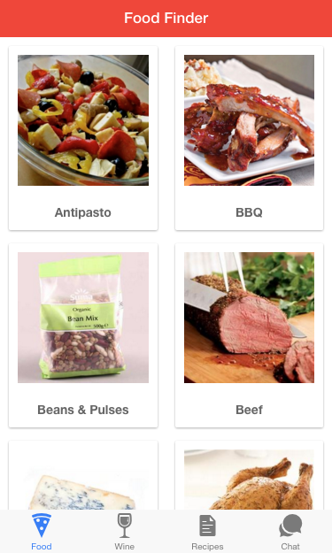
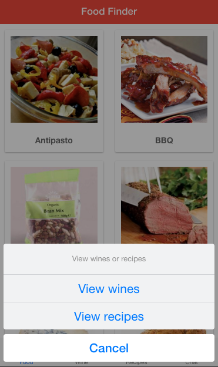
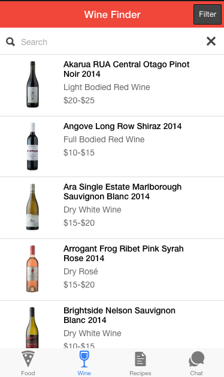
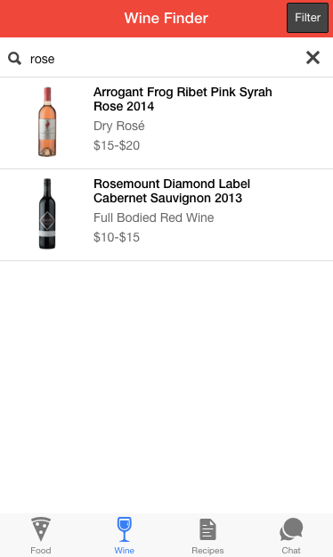
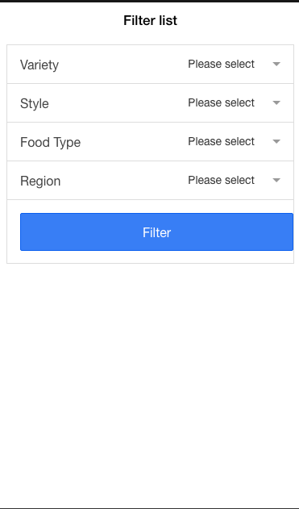
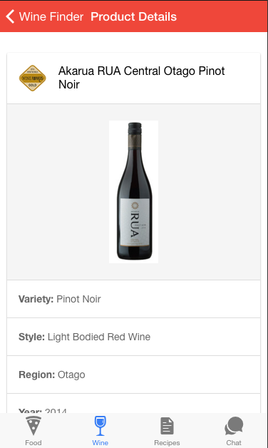
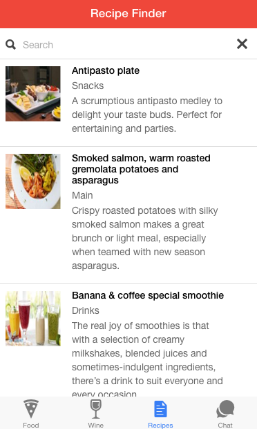
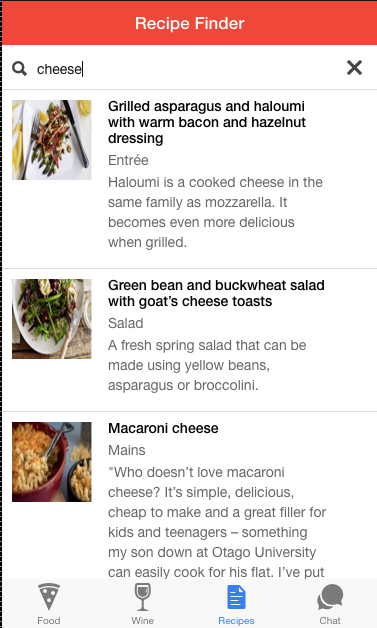
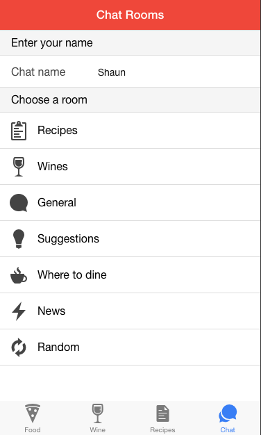
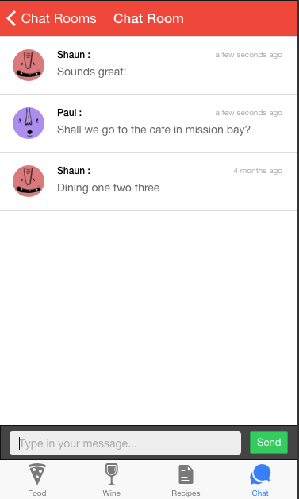

Wine food finder (ionic)
=====================

# wine-food-finder
A quick Ionic Framework and Cordova project featuring utilising the amazing kimono labs web crawler to scrape the data every week from a website and turn it into a set of API's. This app allows the user to quickly find wines, foods, and recipes by a variety of filters (and/or search). It also includes chat with various rooms utilising firebase (real-time cloud based sockets)

## Installation

You will need to include ionic-cli on your computer, then git clone the repo and run npm install && bower install. To run it, simply open your terminal/cmd prompt, cd to the directory, and run ionic serve.

Even better, download the ionic app and simulate it running on your phone!

